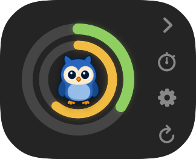
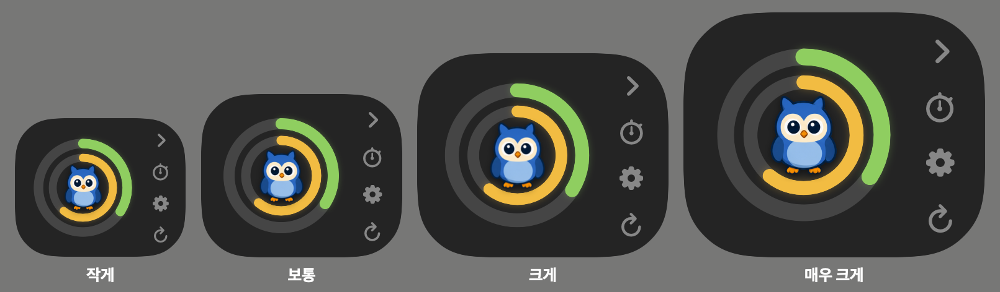
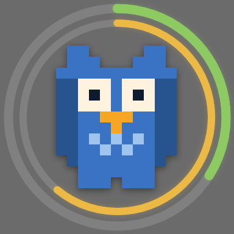

# DongCSU

**Claude 사용량을 화면 위에 항상 띄워두는 앱**

화면은 macOS 판입니다.

---

Claude Code를 쓰다 보면 "지금 한도를 얼마나 썼지?"가 계속 궁금해진다. 확인하려면
하던 걸 멈추고 `/usage`를 쳐야 한다. 그 숫자를 화면 구석에 그냥 띄워둔다.

- 🔵 **사용량 링** — 바깥이 5시간 세션, 안쪽이 7일 주간. 모델별 한도(예: Fable)를 켜면 제일 안쪽에 하나 더
- 🎨 사용률이 오를수록 **초록 → 노랑 → 빨강**으로 연속해서 변한다
- ⏱️ 초기화까지 남은 시간, 다음 조회까지 남은 시간
- 🦉 **픽셀 마스코트** — 한도가 차면 지치고, 조회가 끊기면 색이 빠진다
- 🖥️ 모든 화면 위에. 작업 표시줄·Dock 을 차지하지 않는다

## 어느 쪽을 쓰시나요

| |  |  |
| --- | --- | --- |
| **필요한 버전** | **macOS 14 (Sonoma) 이상** | **Windows 10 1809 이상** 또는 Windows 11 |
| 상주하는 곳 | 메뉴바 | 트레이 |
| 설치 | Homebrew | WinGet · 설치 exe |
| 업데이트 | 터미널에서 `brew upgrade` | 앱이 스스로 |
| 지금 버전 | 2.5.1 | 2.4.0 |
| | **[설치하기 →](mac/README.md)** | **[설치하기 →](win/README.md)** |

**어느 쪽이든 Claude Code에 로그인되어 있어야 합니다.** 이 앱은 Claude Code가 저장해 둔
자격 증명을 읽어서 사용량을 조회합니다. 따로 로그인하지 않습니다.

## 이렇게 생겼습니다

아래 화면은 전부 macOS 판입니다. 윈도우 판은 [윈도우 README](win/README.md)에 있습니다.

<table>
<tr>
<td align="center" width="32%">
 
<b>접으면 링만 남는다</b>
</td>
<td align="center" width="34%">
 
<b>크기 4단계</b>
</td>
<td align="center" width="34%">

 
<b>펫 모드 — 올리면 링이 뜬다</b>
</td>
</tr>
</table>

더블클릭하면 접었다 펴지고, **마스코트를 더블클릭하면** 펫 모드로 들어간다.
펫 모드에서는 혼자 돌아다니고, 커서를 올려두면 비켜주고, 계속 쫓아가면 뛰어서 달아난다.
**타이핑 중에는 가만히 있는다.**

가운데 마스코트는 상태에 따라 움직인다. 자세한 건 **[캐릭터](docs/characters/README.md)**.

<table>
<tr>
<td align="center" width="20%"> <b>평소</b></td>
<td align="center" width="20%"> <b>지침</b> 세션 75%↑</td>
<td align="center" width="20%"> <b>탈진</b> 세션 90%↑</td>
<td align="center" width="20%"> <b>걷기</b> 혼자 다닐 때</td>
<td align="center" width="20%"> <b>달리기</b> 커서가 쫓아올 때</td>
</tr>
</table>

## 캐릭터

기본은 **부엉이**이고 **라쿤**(beta)이 하나 더 들어 있다. 설정 창의 **아이콘** 탭에서 고른다.

**원하는 그림을 넣을 수도 있다.** 24칸에 자세를 나눠 담은 시트 한 장이면 HUD와 펫이
그걸 읽는다.

| | |
| --- | --- |
| 1 | 아래 셋을 그림 AI에게 준다 — **캐릭터 프롬프트**([부엉이](docs/characters/owl.md#그림-시트-프롬프트) · [라쿤](docs/characters/raccoon.md#그림-시트-프롬프트) 참고) + [`prompt.txt`](docs/characters/prompt.txt) 통째로 + [`frame.png`](docs/characters/frame.png) 첨부 |
| 2 | 받은 그림을 `dong-csu --prep-sheet <받은그림> mascot.png` 로 다듬는다 |
| 3 | `mac/Resources/` 에 넣고 다시 빌드한다 |

**[`prompt.txt`](docs/characters/prompt.txt)는 캐릭터가 달라도 고치지 않고 그대로 쓴다.**
종도 색도 가정하지 않고, 여러 번 뽑아 보면서 걸린 것들(배경이 안 비는 것, 걸음이
걷는 것처럼 안 보이는 것, 칸 밖으로 넘치는 것, 눈 감을 때 몸이 튀는 것)을 다 넣어 뒀다.
자세한 건 **[캐릭터 만들기](docs/characters/making.md)**.

> 앱 안에서 그림만 고르면 되도록 만드는 중이다. 지금은 위 세 단계를 손으로 한다.

## 라이선스

[MIT](LICENSE)

> **Anthropic과 무관한 비공식 개인 도구다.** Claude, Claude Code, Clawd 및 관련
> 로고·마스코트의 저작권과 상표권은 전부 **Anthropic**에 있다. MIT 라이선스는 이
> 저장소의 코드에만 적용되며 Anthropic의 아트워크에는 적용되지 않는다.

---

저장소 구조·개발 방식·버전 규칙 등 **만드는 쪽 이야기**는 전부
[작업 규칙](CLAUDE.md)과 [개발](docs/development.md)에 있습니다.
