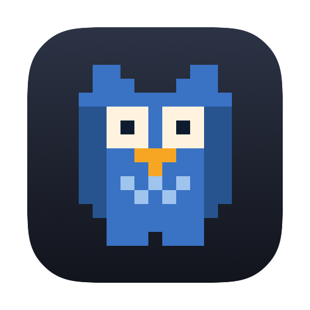
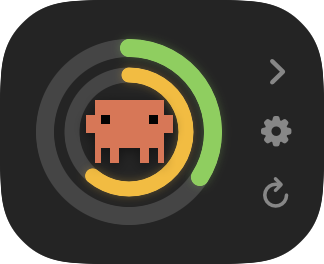
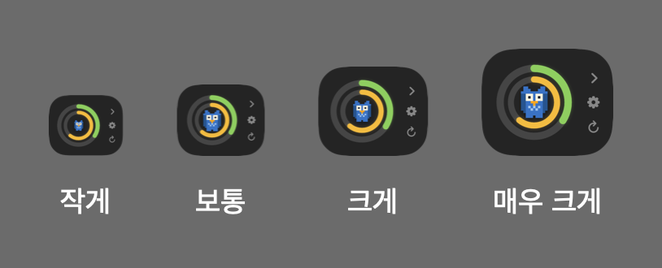
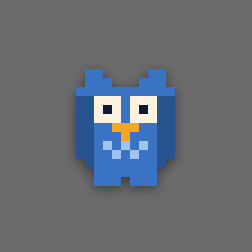
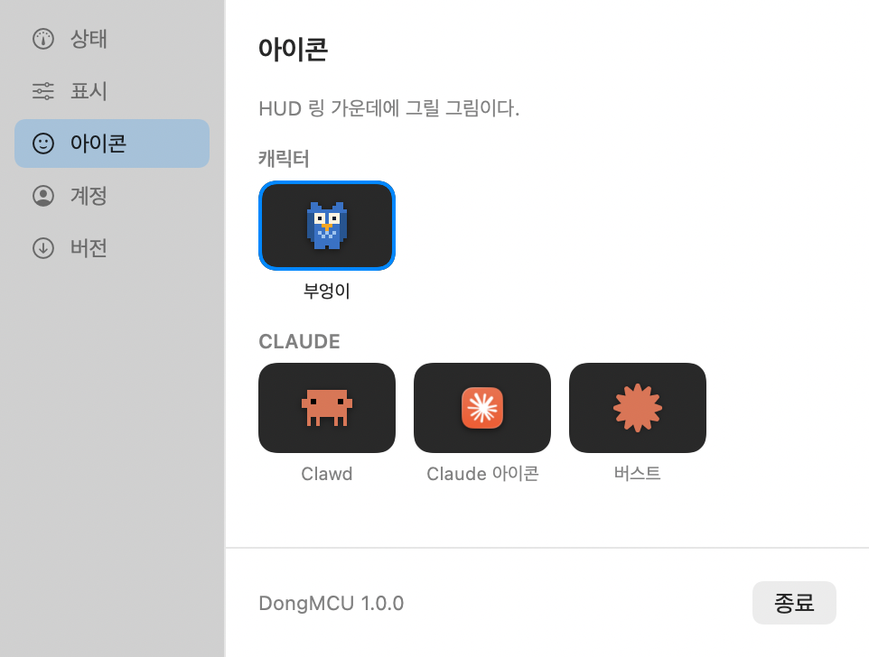
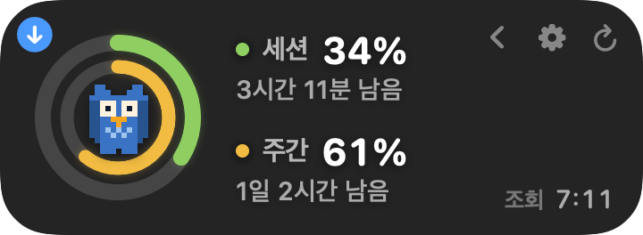

<div align="center">



# DongMCU

**Claude 사용량을 화면 위에 항상 띄워두는 macOS 앱**


[](https://github.com/ldg030201/dong-mcu/releases/latest)


</div>

---

## ✨ 이런 앱

Claude Code를 쓰다 보면 "지금 한도를 얼마나 썼지?"가 계속 궁금해진다.
확인하려면 하던 걸 멈추고 `/usage`를 쳐야 한다. 그 숫자를 화면 구석에 그냥 띄워둔다.

- 🔵 **이중 링** — 바깥이 5시간 세션, 안쪽이 7일 주간
- 🎨 사용률이 오를수록 **초록 → 노랑 → 빨강**으로 연속해서 변한다
- ⏱️ 초기화까지 남은 시간, 다음 조회까지 남은 시간
- 🔔 새 버전이 나오면 알려준다
- 🦉 **[픽셀 마스코트](docs/characters/README.md)** — 한도가 차면 지치고, 조회가 끊기면 색이 빠진다
- 🖥️ 모든 Space와 전체화면 위에. Dock 아이콘 없이 메뉴바에만

<table>
<tr>
<td align="center" width="32%">
<br>
<sub><b>접으면 링만 남는다</b></sub>
</td>
<td align="center" width="34%">
<br>
<sub><b>크기 4단계</b></sub>
</td>
<td align="center" width="34%">

<br>
<sub><b>펫 모드 — 올리면 링이 뜬다</b></sub>
</td>
</tr>
</table>

더블클릭하면 접었다 펴지고, **마스코트를 더블클릭하면** 펫 모드로 들어간다.

가운데 마스코트는 상태에 따라 움직인다. 자세한 건 **[캐릭터](docs/characters/README.md)**.

<table>
<tr>
<td align="center" width="20%"><br><sub><b>평소</b></sub></td>
<td align="center" width="20%"><br><sub><b>지침</b><br>세션 80%↑</sub></td>
<td align="center" width="20%"><br><sub><b>탈진</b><br>세션 95%↑</sub></td>
<td align="center" width="20%"><br><sub><b>끊김</b><br>조회 실패</sub></td>
<td align="center" width="20%"><br><sub><b>끌림</b><br>드래그 중</sub></td>
</tr>
<tr>
<td align="center"><br><sub><b>어지러움</b><br>마구 흔들면</sub></td>
<td align="center"><br><sub><b>걷기</b><br>혼자 다닐 때</sub></td>
<td align="center"><br><sub><b>달리기</b><br>커서가 쫓아올 때</sub></td>
<td colspan="2" align="left"><sub>펫 모드에서는 <b>혼자 돌아다닌다.</b><br>커서를 올려두면 비켜주고, 계속 쫓아가면 <b>뛰어서</b> 달아난다.<br><b>타이핑 중에는 가만히 있는다.</b> 설정 창의 <b>펫</b> 탭에서 끌 수 있다.</sub></td>
</tr>
</table>

## 📦 설치

```bash
brew tap ldg030201/dong-mcu https://github.com/ldg030201/dong-mcu && brew trust ldg030201/dong-mcu && brew install dong-mcu && cp -R "$(brew --prefix dong-mcu)/DongMCU.app" /Applications/ && open /Applications/DongMCU.app
```

### 필요한 것

| | 최소 | 비고 |
| --- | --- | --- |
| **macOS** | 14 (Sonoma) | |
| **Claude Code** | 로그인된 상태 | keychain에 저장된 토큰을 읽는다 |
| **Homebrew** | — | 설치에만 쓴다 |
| **Swift 툴체인** | 5.9 | 소스에서 빌드할 때만. `xcode-select --install` |
| **Xcode** | 불필요 | Command Line Tools만 있으면 된다 |
| **아키텍처** | Apple Silicon | Intel도 되지만 미리 빌드된 결과물이 없어 설치가 오래 걸린다 |
| **외부 의존성** | 없음 | Swift 패키지 0개 |

> [!NOTE]
> **Claude Code 없이는 동작하지 않는다.** 이 앱은 Claude Code가 keychain에 저장해 둔 OAuth
> 토큰으로 사용량을 읽는다. 토큰을 만드는 주체가 Claude Code이기 때문이다.
> 첫 실행 때 keychain 접근을 허용할지 한 번 묻는다.

업데이트는 앱 안의 **업데이트** 버튼으로 하거나:

```bash
brew update && brew upgrade -y dong-mcu && rm -rf /Applications/DongMCU.app && cp -R "$(brew --prefix dong-mcu)/DongMCU.app" /Applications/ && open /Applications/DongMCU.app
```

각 단계가 무엇을 하는지, 소스 빌드, 제거는 **[설치 안내](docs/install.md)** 참고.
설치가 꼬였다면 **[문제 해결](docs/troubleshooting.md)**.

## 🎛️ 쓰는 법

<table>
<tr>
<td width="45%">

</td>
<td>

톱니 버튼이나 `⌘,`로 설정을 연다.
**메뉴바 아이콘**이나 **HUD 우클릭**으로 메뉴가 열린다.

| 탭 | 내용 |
| --- | --- |
| **상태** | 사용량, 초기화·조회 시각 |
| **표시** | 테마, 크기, 조회 주기, 방향 |
| **아이콘** | 가운데 그림 |
| **펫** | 펫 모드, 사용량 링, 스스로 움직이기 |
| **버전** | 업데이트와 변경 내역 |

- **드래그**로 이동, **더블클릭**으로 접기
- **마스코트를 더블클릭**하면 펫 모드
- 위치·크기·아이콘 선택은 기억된다

</td>
</tr>
</table>

새 버전이 나오면 **왼쪽 위에 파란 표시**가 뜬다. 누르면 버전 화면이 열린다.

<div align="center">

</div>

## 🔒 프라이버시

- 🔑 토큰은 **Authorization 헤더로만** 쓰이고 디스크에 쓰거나 로그에 남기지 않는다
- 🌐 Anthropic 사용량 API와 **업데이트 확인용 GitHub** 외에는 접속하지 않는다
- 🚫 통계·추적 없음. 외부 Swift 패키지 **의존성 0개**
- 🖱️ 손쉬운 사용·화면 녹화 같은 **권한을 요청하지 않는다.** 펫이 타이핑 중에
  멈추는 건 "마지막 입력이 언제였나"만 보는 것이고, 무슨 키인지는 읽지 않는다

업데이트 확인을 끄면 Anthropic API 외에 아무 데도 접속하지 않는다.
자세한 내용은 **[사용량과 토큰](docs/privacy.md)**.

## 📚 문서

| | |
| --- | --- |
| [설치 안내](docs/install.md) | 각 단계 설명, 소스 빌드, 업데이트, 제거 |
| [문제 해결](docs/troubleshooting.md) | 설치가 꼬였을 때, 앱이 안 뜰 때 |
| [사용량과 토큰](docs/privacy.md) | 어디서 무엇을 읽는지, 토큰 만료 |
| [캐릭터](docs/characters/README.md) | 마스코트 목록 · [🦉 부엉이](docs/characters/owl.md) |
| [개발](docs/development.md) | 빌드, 렌더 통로 |
| [작업 규칙](CLAUDE.md) | 버전·변경 내역·커밋 규칙 |

## 📄 라이선스

MIT. [LICENSE](LICENSE) 참고.

> **Anthropic과 무관한 비공식 개인 도구다.**
> Claude, Claude Code, Clawd 및 관련 로고·마스코트의 저작권과 상표권은 전부 **Anthropic**에
> 있다. MIT 라이선스는 이 저장소의 코드에만 적용되며 Anthropic의 아트워크에는 적용되지 않는다.
> Anthropic 측에서 요청하면 해당 아트워크를 제거한다.
