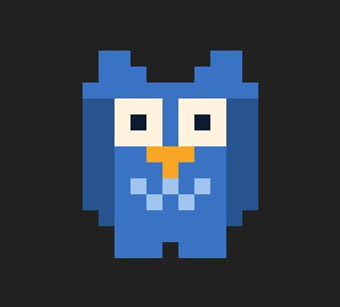
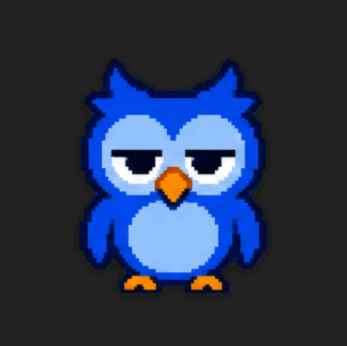
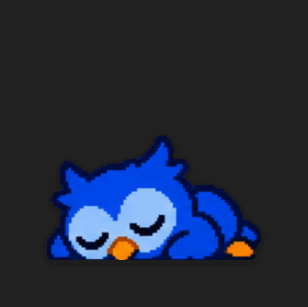
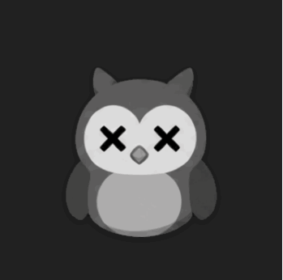
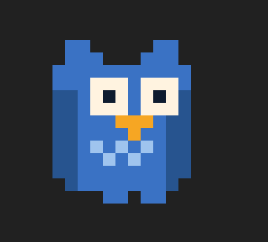
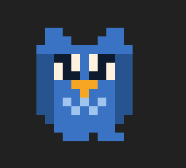
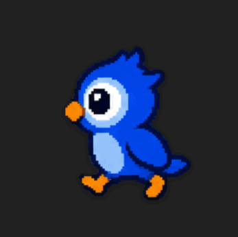
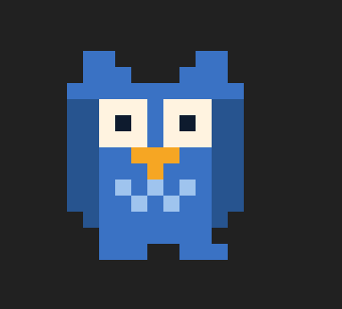
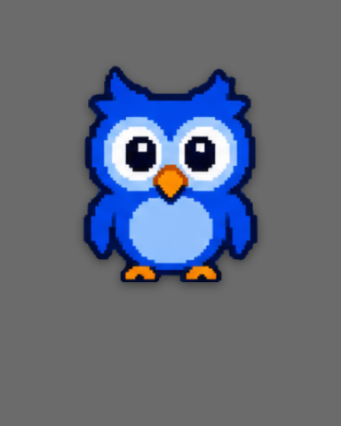

# 🦉 부엉이

[← 캐릭터 목록](README.md) · [← README](../../README.md)

dong-csu의 마스코트. HUD 링 가운데, 메뉴바, 앱 아이콘이 **전부 같은 그리드**를 쓴다.

<div align="center">

</div>

## 기분

사용량·연결 상태·드래그 여부에서 정해진다. 우선순위는 위에서부터가 아니라
**끊김 → 끌림 → 탈진 → 지침 → 평소** 순이다.

**끊김이 가장 세다.** 색이 빠진 채 멈춰 있는 건 "지금 값이 아니다"라는 표시라,
집어 들었다고 색이 돌아오면 조회가 되살아난 것처럼 보인다. 끌든 걷든 끊긴 동안에는
회색으로 굳어 있고, 스스로 걸어다니지도 않는다.

<table>
<tr>
<td align="center" width="20%"><br><sub><b>평소</b></sub></td>
<td align="center" width="20%"><br><sub><b>지침</b></sub></td>
<td align="center" width="20%"><br><sub><b>탈진</b></sub></td>
<td align="center" width="20%"><br><sub><b>끊김</b></sub></td>
<td align="center" width="20%"><br><sub><b>끌림</b></sub></td>
</tr>
<tr>
<td align="center"><br><sub><b>어지러움</b></sub></td>
<td colspan="4" align="left"><sub>마구 흔들어 놓으면 눈이 풀린다.<br>사용량이 아니라 <b>어떻게 다뤄졌는지</b>에서 나오는 유일한 기분이다.</sub></td>
</tr>
</table>

| 기분 | 언제 | 모습 |
| --- | --- | --- |
| **평소** | 그 밖에 | 2~3.6초마다 한 번 깜빡인다 |
| **지침** | 세션 **75%** 이상 | 날개를 늘어뜨리고 눈을 반쯤 뜬다 |
| **탈진** | 세션 **90%** 이상 | 발 위로 주저앉아 다리가 몸에 가려진다 |
| **끊김** | 재로그인이 필요하거나 값이 오래됨 | 색이 빠지고 완전히 멈춘다 |
| **끌림** | 창을 끄는 중 | 목을 잡혀 매달린 채 끌려간다 |
| **어지러움** | 마구 흔들린 직후 | 눈이 풀리고 비틀거린다 (2.4초) |

### 걸음걸이는 기분이 아니다

<table>
<tr>
<td align="center" width="130"><br><sub><b>걷기</b><br>배회 · 커서 피하기</sub></td>
<td align="center" width="130"><br><sub><b>달리기</b><br>커서가 쫓아올 때</sub></td>
<td align="left"><sub>발을 갈아 딛는 건 <b>기분 위에 얹히는 것</b>이라 <code>OwlMood</code>에 넣지 않았다 —<br>지친 부엉이도 걸어다녀야 하고, 걷는다고 눈이 다시 떠지면 사용량이<br>줄어든 것처럼 읽힌다. 기분이 정한 눈은 그대로 두고 발과 몸 흔들림만 덮어쓴다.</sub></td>
</tr>
</table>

네 칸 한 바퀴다. **한 발 딛고 → 모으고 → 다른 발 딛고 → 모은다.** 두 칸(A ↔ B)만
쓰면 발이 좌우로 튀기만 해서 걷는 게 아니라 미끄러지는 것으로 보인다.

**뛸 때는 발을 모으는 칸마다 날개를 펼친다.** 부엉이는 다리가 짧아서 발만 빨리 놀리면
급한 게 아니라 종종거리는 것으로 보인다. 날개를 써야 읽힌다.

펼친 날개는 좌우 여백 두 칸을 끝까지 쓴다. 그래서 **몸이 기운 칸에서 펴면 바깥쪽 한
칸이 캔버스 밖으로 잘려** 한쪽 날개만 짧아진다. 기울기가 0인 칸에서만 펴면 그 일이
없고, 딛고 → 펴고 → 딛고 순서라 도약으로도 읽힌다.

**얼굴은 몸을 그대로 따라간다(`faceLean` 0).** 여기서 매달렸을 때처럼 얼굴을 뒤에
남기면 안 된다 — 몸만 흔들리고 눈·부리는 공간에 못 박힌 채라서 **징그럽다.** 걷는
부엉이는 매달린 게 아니라 통짜로 뒤뚱거린다. 얼굴이 뒤따라오는 건 몸이 **끌려갈 때**의
규칙이지 걸을 때의 규칙이 아니다.

**걷는 동안에도 깜빡인다.** 기분이 준 첫 프레임에 눈을 붙박아 두면 걷는 내내 뜨고만
있어서, 살아 있는 게 아니라 굳은 채로 미끄러지는 것처럼 보인다. 다만 **지친 눈을 억지로
뜨게 하지는 않는다** — 이미 감고 있는 부엉이(탈진)는 반대로 이따금 실눈을 뜨는 것으로
대신한다. 간격에는 지터를 준다.

주저앉은 자세(`bob`)는 걸을 때 벗긴다 — 다리가 몸에 가려져서 역시 미끄러지는 것으로 보인다.

**끌리는 동안에는 걷지 않는다.** 허공에서 발을 갈아 딛으면 우스워진다.

**끌림만은 시간표가 아니라 마우스가 자세를 정한다.** 다른 기분은 정해진 프레임을
차례로 돌지만, 끌림은 마우스가 어느 쪽으로 얼마나 빨리 가는지를 매 틱 읽어서
그때그때 자세를 만든다. 정해진 흔들림은 손을 멈춰도 계속 흔들려서 들고 있는 게
아니라 태엽을 감아 둔 것처럼 보인다.

| | |
| --- | --- |
| 마우스가 **오른쪽**으로 | 몸이 **왼쪽**으로 처진다 (매달린 건 손보다 늦게 온다) |
| **위로** 들어 올리면 | 날개를 든다 (200pt/s 넘게) |
| **아래로** 세게 내리면 | 날개를 활짝 편다 (620pt/s 넘게) |
| 마우스가 **느리면** | 처지지 않고 그냥 매달려 있다 (140pt/s 미만) |
| 손을 **멈추면** | 두 틱에 걸쳐 가운데로 돌아온다 |
| **홱홱 뒤집거나 아주 빠르면** | 흔들림이 쌓여 어지러워진다 |

### 어지러움

끌면서 **방향이 홱 뒤집힐 때**(320pt/s 넘게) 점수가 크게 오르고, **아주 빠르게
끌면**(950pt/s 넘게) 조금씩 오른다. 가만히 옮기는 동안에는 저절로 빠져서, 창을
천천히 옮기는 것만으로는 절대 어지러워지지 않는다. 문턱을 넘으면 2.4초간 지속된다.

흔들림 점수는 **끌 때마다 새로 센다.** 사이를 두고 조금씩 흔든 게 쌓여서 갑자기
어지러워지면 무엇 때문인지 알 수 없다.

세로로만 마구 흔들어도 어지러워진다. 방향 뒤집힘은 가로·세로를 따로 세고,
빠르기는 두 축을 합친 값으로 본다.

**끌고 있는 동안에는 눈만 풀린다.** 손에 들려 있는데 바닥에서 비틀거리면 앞뒤가 안
맞으니, 내려놓은 뒤에야 제대로 비틀거린다.

**주간이 아니라 세션(5시간) 사용률만 본다.** 주간은 며칠에 걸쳐 천천히 차서,
그걸로 지치게 하면 한 주 내내 지친 얼굴로 있게 된다.

**끊김에서 눈을 감기거나 뒤집지 않는다.** 죽은 척을 하면 사용자가 *앱이* 죽은 줄
안다. 실제로는 재로그인만 하면 되는 상태다.

## 부엉이답게

같은 흔들림이라도 **부엉이가 하는 방식**이 따로 있다. 끌림이 그 규칙을 다 쓴다.

| | |
| --- | --- |
| **차례로 뒤따라온다** | 몸이 먼저 가고 얼굴이 한 박자, 다리가 두 박자 뒤에 온다 |
| **힘을 뺀다** | 들리면 날개를 늘어뜨리고 다리를 모은다. 퍼덕이면 도망치려는 몸부림이 된다 |
| **가끔 깜빡인다** | 매달린 내내 눈을 뜨고만 있으면 살아 있는 게 아니라 굳은 것처럼 보인다 |

버린 방법이 둘 있다.

**머리 윤곽을 몸통에서 떼어 고정하기.** 폭이 같은 덩어리가 한 칸 어긋나면 고개를
든 게 아니라 그림이 깨진 것처럼 보인다. 얼굴(눈·부리)만 움직이는 쪽이 고개를 돌린
것으로 읽힌다.

**얼굴을 완전히 붙박아 두기.** 몸이 기운 만큼 얼굴을 정확히 되돌리면 시선이 못
박힌 듯 굳어서 **무섭다.** 한 박자 늦게 따라오게 두면 얼굴도 움직이면서 여전히
몸보다 뒤에 남는다.

## 펫 모드



**마스코트를 더블클릭하면** 펫 모드로 들어가고, 다시 더블클릭하면 들어오기 직전의
보기로 돌아간다. 마스코트 **밖**을 더블클릭하면 예전처럼 접었다 폈다 한다 — 셋을 한
줄로 돌리면 접으려다 펫으로 넘어가서, 접기가 무엇을 할지 예측할 수 없어진다.

펫에서는 카드 배경도 링도 없이 마스코트만 떠 있고, 뒤에 두르는 링은 설정 창의
**펫** 탭에서 *항상 / 마우스를 올리면 / 표시 안 함* 중에 고른다(기본은 마우스를 올리면).

<br clear="left">

창은 링이 들어갈 만큼 잡아 두고 그 안을 비워 둔다. 호버할 때 창을 늘리면 커서가
창 밖으로 밀려나 호버가 끊기고, 그 자리에서 켜졌다 꺼졌다 한다. 대신 마우스를 받는
자리를 링 크기로 좁혀서, 투명한 네 귀퉁이를 눌러도 뒤에 있는 창이 눌리게 했다.

카드가 없으므로 배경·테두리와 **창 그림자**를 모두 끈다. 창 그림자는 내용이 바뀔
때마다 `invalidateShadow()`를 불러야 맞는데, 프레임마다 움직이는 그림에 그걸 걸면
비싸다. 마스코트가 자기 그림자를 갖고 있어서 없어도 된다.

### 스스로 움직이기

[`PetMotionController`](../../mac/Sources/DongCSU/PetMotion.swift)가 창을 옮기는 유일한
주인이다. 배회와 회피를 따로 두면 각자 잡은 목표가 매 틱 서로를 덮어써서 제자리에서
떨린다. **회피가 항상 배회를 끊는다.**

| 설정 | 하는 일 | 속도 |
| --- | --- | --- |
| **혼자 돌아다니기** (기본 켜짐) | 3~11초 쉬었다가 가로로 90~360pt 걷는다. 세로는 ±70pt까지만 — 부엉이는 걸어 다니지 날아다니지 않는다 | 걷기 26pt/s |
| **커서 피하기** (기본 켜짐) | 커서가 올라온 채 0.5초가 지나도록 잡지 않으면 반대쪽으로 창 한 변의 1.15배만큼 물러난다 | 걷기 210pt/s<br>쫓기면 달리기 300pt/s |

**한 번 비켰는데 4초 안에 또 비켜야 하면 뛴다.** 커서가 따라온 것이니 장난치는 중이고,
그때도 느긋하게 걸으면 잡히려고 서 있는 것처럼 보인다.

**조회가 끊긴 동안에는 아무것도 하지 않는다.** 회색으로 굳은 채 걸어다니면
"멈췄다"는 표시가 무색해진다.

**전부 펫 모드에서만 돈다.** 숫자가 붙은 카드가 혼자 걸어다니면 읽으려던 값이 도망가고,
접힌 링은 서랍 손잡이라 자리가 고정돼 있어야 한다.

#### 글을 쓰는 동안에는 가만히 있는다

배회는 방향을 가리지 않아서 **방금 쓴 글 위를 왼쪽으로 가로지르고**, 커서 피하기도
커서가 오른쪽에 있으면 왼쪽으로 물러난다. 둘 다 이미 쓴 것을 덮는 움직임이다.
그래서 글을 쓰는 동안에는 아무것도 하지 않고, 입력이 멎고 5초가 지나야 다시 움직인다.

`CGEventSource.secondsSinceLastEventType(.hidSystemState, eventType: .keyDown)`이
**마지막 키 입력 뒤 몇 초가 지났는지**를 돌려준다. 무슨 키를 눌렀는지가 아니라 언제
눌렸는지만 주는 값이라 **아무 권한도 필요 없다.**

> 여기서 한 발 더 나가 **글자가 닿을 때 비켜주는 것**까지 만들어 봤는데 보류했다.
> 캐럿이 어디 있는지는 손쉬운 사용 권한으로만 알 수 있고, 권한이 있어도 Electron으로
> 만든 앱들이 그 정보를 안 내준다. 창 자리만 가지고 어림잡아 물러나게 했더니
> **가리지도 않았는데 도망가는** 꼴이 됐다. 작업은 `pet-typing-dodge` 브랜치에 있다.

잡고 있는 동안·메뉴가 떠 있는 동안·화면이 꺼진 동안에는 멈춘다. 위치는 **자리를 잡은
뒤에 한 번만** 저장한다 — 걷는 내내 저장하면 UserDefaults를 초당 열 번 쓴다.

## 그리드

[`OwlMark.swift`](../../mac/Sources/DongCSU/OwlMark.swift)에 **15열 × 13행**으로 들어 있다.
몸통은 가운데 11열만 쓰고 **좌우 2열은 날개를 펼 여백**이라 정지 상태에서는 비어 있다.
그래서 링 안에 넣을 때는 세로를 기준으로 크기를 맞춘다.

파츠를 따로 두고 겹쳐 그린다. 눈만 갈아끼우면 깜빡이고, 날개 레이어만 바꾸면 펴진다.

| 글자 | 파츠 | 레이어 |
| --- | --- | --- |
| `#` | 몸통·발 | `body` `bodyHanging` `feetStand` `feetStepA` `feetStepB` `feetDangle` |
| `d` | 날개 | `wingsFolded` `wingsSpread` `wingsDroop` `wingsLift` |
| `l` | 배 무늬 | `belly` |
| `w` `k` | 눈 흰자·눈동자 | `eyesOpen` `eyesHalf` `eyesClosed` `eyesDizzy` |
| `y` | 부리 | `beak` |

### 자세

[`OwlPose`](../../mac/Sources/DongCSU/OwlMark.swift)가 조합을 담는다.

| 값 | 범위 | 쓰임 |
| --- | --- | --- |
| `eyes` | `open` `half` `closed` `dizzy` | 깜빡임 3단계 + 풀린 눈 |
| `wings` | `folded` `spread` `droop` `lift` | 늘어뜨림 → 접힘 → 듦 → 펼침 순으로 올라간다 |
| `feet` | `stand` `stepA` `stepB` `dangle` | 서기 / 걷기 / 매달리기 |
| `lean` | 정수 | 몸을 통째로 좌우로 |
| `bob` | 정수 | 몸을 통째로 위아래로. 양수면 주저앉는다 |
| `faceLean` | 정수 | 눈·부리만 **더** 좌우로. `lean`에 더해진다 |
| `feetLean` | 정수 | 다리의 좌우 자리 |

`lean`과 `bob`은 **발을 빼고** 몸에만 걸린다. 발까지 같이 움직이면 땅에서 떠 보인다.

매달린 자세는 손으로 조합하지 말고 `OwlPose.carried(lean:face:feet:eyes:wings:)`를 쓴다.
`face`·`feet`을 **화면에서의 자리**로 받아서 몸 기울기를 알아서 빼 준다. 프레임마다
손으로 계산하면 한 군데만 어긋나도 거기서 얼굴이 튄다.

`feet`이 `.dangle`이면 몸통이 자동으로 `bodyHanging`으로 바뀐다. 매달린 다리는 두 줄이라
몸통 아랫단과 겹치는데, 그 줄을 비우지 않으면 다리가 몸에 덮여 보이지 않는다.

### 색

`OwlPalette`가 색 한 벌을 들고 있어서, 같은 자세를 팔레트만 바꿔 다시 그린다.

| 팔레트 | 쓰임 |
| --- | --- |
| `normal` | 평소 |
| `offline` | 조회가 안 되는 동안. 채도를 뺀다 |
| `tinted(body:)` | 몸통·날개만 물들인다. 테스트판 구분용 |

`tinted`는 **눈과 부리를 그대로 둔다.** 단색으로 칠해 버리면 눈까지 사라져서
무슨 그림인지 알 수 없다.

**보라색은 메뉴바 아이콘에만 쓴다.** 한동안 테스트판은 HUD 안 마스코트까지 물들였다 —
펫 모드에는 버전 글자를 붙일 자리가 없어서 색이 유일한 단서라고 봤다. 그런데 그러면
**캐릭터를 확인하려고 띄운 테스트판에서 정작 그 캐릭터 색을 못 본다.** 새 그림을
넣고 보는 것이 테스트판을 띄우는 가장 큰 이유라 순서가 뒤바뀌어 있었다.

지금은 마스코트가 정식판과 같은 색이고, 구분은 **메뉴바 아이콘**과 **HUD 버전
딱지(`test`)** 가 한다.

## 그림 시트 프롬프트

HUD와 펫에 나오는 부엉이는 [그림 시트](making.md) 한 장이다(위 그리드는 메뉴바·앱
아이콘·`shared/owl.json`이 쓰는 **오리지널**이고, 둘은 서로 다른 그림이다).

시트를 다시 받을 때 [`prompt.txt`](prompt.txt) 위에 얹는 **부엉이 전용** 부분이 이거다.
공통 프롬프트는 캐릭터를 가정하지 않으므로, 종·색·비율은 전부 여기서 온다.

```
둥글고 통통한 파란 부엉이 캐릭터의 스프라이트 시트를 만들어 줘.
첨부한 견본은 칸 배치와 화풍만 보고, 캐릭터도 자세도 새로 그린다.

몸매   공 두 개를 겹친 눈사람 모양. 목이 없다.
       ** 옆에서 봐도 똑같이 통통하다 ** — 가슴에서 등까지 두께가 정면 어깨 폭의
       85% 이상이다. 참새나 앵무새 같은 홀쭉한 옆모습은 다른 캐릭터다.
머리   몸통만큼 크다. 머리 위 양쪽에 뾰족한 깃뿔 두 개.
얼굴   크림색 얼굴 원반이 넓게 깔리고 그 위에 크고 동그란 눈 두 개.
       ** 눈 하나가 얼굴 원반 폭의 1/3 을 차지할 만큼 크다. **
눈     흰 눈알을 크고 둥글게 깔고, 그 안에 남색 눈동자, 눈동자 안에 흰 점 하나.
       ** 눈동자는 흰자보다 확실히 작다 ** — 흰자가 넓게 보여야 멍하고 귀엽다.
주둥이 작은 주황색 마름모 부리 하나. 두 눈 사이 아래에 붙는다.
       ** 작게 유지한다 ** — 크면 표정이 또렷해져서 멍한 맛이 없어진다.
배     밝은 하늘색 타원이 몸통 앞을 크게 덮는다.
앞다리 ** 이 캐릭터의 "붙잡는 앞다리" 는 날개다. **
       몸 양옆에 붙은 둥근 주걱 모양, 진한 파랑. 깃털은 한 올씩 그리지 않고
       ** 한 덩어리 단색 ** 으로 둔다.
       ** 날개로는 움켜쥐지 못한다 ** — 벽붙기에서는 날개로 벽을 끌어안지만,
       아래매달리기는 뒷발로 잡고 몸이 뒤집힌다(공통 프롬프트의 갈래 ㄴ).
뒷다리 짧고 굵은 주황색 다리 두 개, 발가락 셋.
       ** 몸통 아래로 살짝 삐져나와 보인다. 길이는 키의 15%. **
       평소 칸에서도 보인다 — 걷기 · 걸터앉기 · 아래매달리기가 이 다리를 쓴다.
       ** 아래매달리기에서 창 안으로 넘어가는 것이 이 발과 발목이다. **
꼬리   그리지 않는다. 이 캐릭터는 꼬리가 안 보이는 몸이다.

색     아래 여섯 색과 흰자 · 윤곽선, 모두 여덟 색이 전부다. 적힌 hex 를 그대로 쓴다.
       흰자          #FFFFFF
       몸 · 깃뿔     #3A72C4
       날개 · 그늘   #27548F
       배            #9FC4EE
       얼굴          #FFF3E0
       부리 · 다리   #F6A623
       눈동자        #0E1B2E
       윤곽선        위 색들보다 확실히 어두운 남색 하나

       죽음 칸은 위 색을 아래 회색으로 짝지어 바꾼 것만 쓴다.
       몸 → #666666   날개 → #424242   배 → #999999
       얼굴 → #D6D6D6  부리·다리 → #ADADAD   눈동자 → #1F1F1F
```

> [!IMPORTANT]
> **여섯 색의 원본은 [`shared/owl.json`](../../shared/owl.json)의 `palettes` 다.**
> 손으로 옮겨 적은 값이라 저쪽을 고치면 여기도 같이 고쳐야 한다. 윤곽선 색만 원본에
> 없다 — 오리지널 그리드에는 윤곽선 레이어가 없어서 말로만 적었다.

**옆모습이 홀쭉해지는 것은 양쪽에서 막는다.** 공통 프롬프트의 85%는 어느 캐릭터에나
걸리는 **검사**고, 여기 "공 두 개 · 목 없음 · 짧고 굵은 다리"는 **설계**다. 예전
캐릭터 프롬프트에도 "통통한 부엉이"라고 적혀 있었는데 2줄(걷기)만 참새가 됐다 —
검사만으로는 안 걸린다.

**날개는 못 움켜쥔다는 것을 여기서 적는다.** 공통 프롬프트는 아래매달리기를
`움켜쥘 수 있으면 앞다리로 잡고 뒷모습 / 못 움켜쥐면 뒷발로 잡고 앞모습 뒤집힘`
두 갈래로 가르는데, 어느 쪽인지는 캐릭터가 정한다. 라쿤은 손이 있어 앞 갈래고
**부엉이는 뒤 갈래**다 — 그래서 부엉이만 거꾸로 매달린다.

**"이 캐릭터를 그대로 지켜라"라고 적지 마라.** 시트를 다시 받을 때 그렇게 써 봤는데
결과가 뻣뻣하게 나왔다. 첨부한 그림이 이미 그 일을 하고 있어서, 글로 한 번 더 못 박으면
그림을 베끼는 쪽으로만 몰린다. **"캐릭터는 새로 그린다"로 두는 편이 낫다** — 첨부를
참고하면서도 더 나은 것이 나올 자리가 남는다.

## 움직이는 방식

[`OwlAnimator`](../../mac/Sources/DongCSU/OwlAnimator.swift)가 기분에 맞는 프레임을 차례로 넘긴다.

**프레임마다 일회용 타이머를 새로 건다.** `TimelineView(.animation)`처럼 화면 주사율에
맞춰 도는 방식을 쓰면, 항상 위에 떠 있는 창이라 WindowServer가 쉬지 않고 합성한다.
가만히 있는 부엉이는 몇 초에 한 번만 깨우면 되고, 그 차이가 그대로 전력이 된다.

- 프레임이 **하나뿐인 기분(끊김)은 타이머를 아예 걸지 않는다**
- 타이머는 `.common` 모드에 건다. 기본 모드에만 걸면 창을 끄는 동안 다리가 멈춘다
- **화면이 꺼지면 멈춘다.** 아무도 보지 않는데 깨어날 이유가 없다
- 부엉이가 아닌 아이콘을 골라도, HUD를 숨겨도 멈춘다

깜빡임 간격에는 지터를 준다. 없으면 정확히 같은 박자로 깜빡여서 시계처럼 보인다.

### 비용을 잴 때

**폴링이 도는 동안 잰 CPU는 믿지 마라.** 사용량 조회 한 번이 애니메이션 몇 분 치보다
비싸서, 잰 구간 안에 조회가 들어갔는지에 따라 부호까지 뒤집힌다. 실제로 같은 두 빌드를
두 번 쟀더니 한 번은 애니메이션 쪽이 +0.27%p, 다음엔 −0.30%p가 나왔다.

제대로 재려면 조회 주기를 길게 막아 구간 안에 조회가 안 들어오게 하고, **같은 앱에서
아이콘만 바꿔가며**(부엉이 ↔ 다른 아이콘) 여러 구간을 번갈아 잰다. 부엉이가 아닌
아이콘을 고르면 애니메이터가 멈추므로 나머지 조건이 전부 같아진다.

```bash
defaults write com.ldg.dong-csu-test hud.pollInterval -int 1800
defaults write com.ldg.dong-csu-test hud.iconStyle -string clawd   # 애니메이션 끔
```

## 확인하기

앱을 띄우고 몇 초씩 기다리지 않고 본다.

```bash
dong-csu --render-owl out.png 96              # 기분·걷기 전 프레임을 한 장에
dong-csu --render-owl-gif docs/characters/owl # 하나마다 움직이는 GIF
```

두 통로 다 `OwlAnimation.all`을 돈다. 기분 목록만 돌면 **걷기가 통째로 빠지므로**
(걷기는 기분이 아니다) 보여줄 것들을 거기 한 곳에 모아 뒀다.

이 문서의 GIF는 두 번째 명령으로 만든 것이다. 프레임 시간을 소스에서 그대로 읽으므로
**자세를 고쳤으면 다시 돌려서 갱신한다.** 손으로 만들지 않는다.

> 끌림은 실제로는 마우스가 자세를 정하므로 `frames`를 쓰지 않는다. 거기 적힌 목록은
> 문서와 렌더 통로에 보여줄 **대표 한 바퀴**다. 자세를 만드는 `carried(...)`는 같은 걸
> 쓰므로 모양은 어긋나지 않지만, 순서와 시간은 실제로 끌 때와 다르다.

> 크기가 달라 보인다는 인상은 믿지 말고 픽셀로 확인한다. 주저앉은 자세는 다리가
> 몸에 가려져 실제로 한 칸 짧다.

## 크기

한 칸이 정수가 아니면 어떤 행은 2px, 어떤 행은 3px로 그려져 **자리마다 다른 얼굴**이
된다. 그래서 칸 크기를 내림해서 정수로 맞추고 남는 여백은 가운데로 몬다.

| 자리 | 한 칸 |
| --- | --- |
| 메뉴바 (16pt) | 1pt |
| HUD 링 안 (29pt) | 2pt |
| 앱 아이콘 (1024px) | 64px |

HUD 크기 설정도 같은 이유로 `scaleEffect`가 아니라 치수에 배율을 곱하는 방식이다.
확대 변환을 걸면 픽셀 그림이 흐려지지만, 배율을 곱해 다시 그리면 한 칸도 같이 커져서
큰 크기에서 오히려 더 선명해진다.

앱 아이콘 그림은 [`AppIconArt.swift`](../../mac/Sources/DongCSU/AppIconArt.swift)에 있다.
고쳤으면 `./make-icon.sh`로 `.icns`를 다시 만든다.
