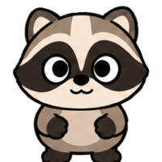

# 🦝 라쿤

[← 캐릭터 목록](README.md) · [← README](../../README.md)

**그림 시트 한 장으로만 도는 첫 캐릭터다.** 부엉이와 코드를 하나도 나눠 쓰지 않는다 —
[`ClaudeIconStyle.sheetResource`](../../mac/Sources/DongCSU/ClaudeIcon.swift)에 한 줄
더하고 `mac/Resources/raccoon.png` 를 둔 것이 전부다.

<div align="center">

</div>

기분·걸음걸이·펫 모드·창에 붙기는 전부 [부엉이 문서](owl.md)와 같다. 판단하는 코드가
한 벌뿐이라 캐릭터를 바꿔도 달라지는 것은 그림뿐이다.

## 부엉이와 다른 것

| | |
| --- | --- |
| **오리지널이 없다** | 격자로 그린 판이 없어서 메뉴바 아이콘·앱 아이콘·`shared/owl.json` 은 계속 부엉이다 |
| **꼬리가 옆모습에만 있다** | 정면 칸은 좌우 대칭이어야 하는데(좌우 반전으로 오른쪽 그림을 만든다) 꼬리는 한쪽으로 치우친다 |
| **손으로 매달린다** | 부엉이는 날개로 못 움켜쥐어서 발로 잡고 뒤집히지만, 라쿤은 손이 있어 똑바로 매달린다 |
| **매달릴 때 등이 보인다** | 테두리를 잡으려면 그쪽을 보게 된다. 그 두 칸만 뒷모습이라 얼굴이 없고, 눈감음 짝도 같은 그림이다 |
| **옆으로 더 퍼진다** | 꼬리 때문에 벽붙기 잉크가 부엉이 59pt 대 82pt다. 잡는 깊이는 잉크의 비율이라 저절로 따라간다 |

## 그림 시트 프롬프트

시트를 다시 받을 때 [`prompt.txt`](prompt.txt) 위에 얹는 **라쿤 전용** 부분이다.
넘기는 법은 [캐릭터 만들기](making.md).

```
둥글고 통통한 회갈색 라쿤 캐릭터의 스프라이트 시트를 만들어 줘.
첨부한 견본은 칸 배치와 화풍만 보고, 캐릭터도 자세도 새로 그린다.

몸매   공 두 개를 겹친 눈사람 모양. 목이 없다.
       ** 옆에서 봐도 똑같이 통통하다 ** — 족제비나 여우 같은 길쭉한 옆모습이 아니다.
머리   몸통만큼 크다. 머리 위 양쪽에 작고 동그란 반원 귀 두 개.
얼굴   크림색 얼굴 위로 ** 검은 도둑 가면 ** 이 두 눈을 가로질러 띠처럼 지나간다.
       ** 이 가면이 이 캐릭터를 알아보게 하는 가장 큰 덩어리다 ** — 얼굴 폭을 끝에서
       끝까지 다 쓰고, 눈보다 위아래로 넉넉히 넘친다. 이마 가운데로 크림색이 갈라져
       들어온다.
눈     검은 가면 한가운데에 흰 눈알을 크고 둥글게 깔고, 그 안에 눈동자, 눈동자 안에
       흰 점 하나. ** 가면 위에 얹힌 흰자라 눈을 꽉 채우면 가면과 뭉개진다. **
주둥이 짧고 뭉툭한 크림색 주둥이에 검은 코 하나. ** 뾰족하게 빼면 여우가 된다. **
앞다리 ** 이 캐릭터의 "붙잡는 앞다리" 는 팔과 손이다. **
       짧고 통통한 팔 끝에 손이 달렸고, 손가락은 ** 뭉툭하게 셋 ** — 다섯 개를
       그리거나 마디를 나누면 줄였을 때 뭉개진 점이 된다. 손은 팔보다 어둡다.
뒷다리 짧고 굵은 다리 두 개, 발가락 셋. 손과 같은 어두운 색.
       ** 몸통 아래로 살짝 삐져나와 보인다. 길이는 전체 키의 15%. **
꼬리   굵고 복슬복슬한 꼬리에 ** 어두운 줄무늬 셋. ** 줄무늬는 굵게 — 가늘게 여러 개
       그리면 줄이는 순간 얼룩으로 보인다.
       ** 꼬리가 보이는 것은 옆모습 여덟 칸과 뒷모습 매달리기뿐이다. ** 몸 뒤쪽에서
       위로 말려 올라간다. 정면 칸에서는 몸에 가려 안 보인다 — 정면은 좌우 대칭이어야
       하는데 꼬리가 한쪽으로 치우치면 좌우 반전할 때 그것만 튄다.

색     아래 여섯 색이 전부다. 여기 적힌 hex 값을 그대로 쓴다.
       흰자 · 눈 흰 점                    #FFFFFF
       몸 · 귀 · 팔                       #A2988C
       가슴 · 배                          #C4BAAE
       손 · 발 · 등 · 꼬리 줄무늬 · 그늘  #5E5349
       얼굴 · 주둥이                      #F2EBE1
       가면 · 코 · 눈동자 · 윤곽선        #2B2521

       ** 배는 몸보다 살짝 밝은 #C4BAAE 다. ** 얼굴 크림색(#F2EBE1)을 배에도 쓰면
       머리와 몸이 한 덩어리로 뭉개진다.

       죽음 칸은 위 색을 아래 회색으로 짝지어 바꾼 것만 쓴다.
       몸 → #6E6E6E   가슴·배 → #8A8A8A   손·발·등·줄무늬 → #454545
       얼굴 → #D6D6D6   가면·코·눈·윤곽선 → #1F1F1F

첨부   견본이 부엉이 시트라면 ** 3줄 자세는 이 글에서만 가져온다. ** 부엉이는 날개라
       발로 잡고 거꾸로 매달리지만, 라쿤은 손이 있어 ** 등을 보이고 ** 팔로 잡고
       똑바로 매달린다. 그 두 칸에는 얼굴이 안 보이고 줄무늬 꼬리가 등 뒤로 내려온다.
```

**부엉이와 달리 색의 원본이 소스에 없다.** 격자 판이 없어서
[`shared/owl.json`](../../shared/owl.json) 같은 대조본이 없고, 여기 적힌 hex 가
그대로 원본이다. 시트를 다시 받을 때 이 값을 그대로 넘긴다.

## 확인하기

```bash
dong-csu --probe-mascot raccoonSheet   # 칸이 몇 개 읽혔는지, 무엇이 어디로 떨어지는지
dong-csu --probe-perch  raccoonSheet   # 창 테두리에 붙는 자리가 그림과 맞는지
```

**캐릭터 이름을 안 붙이면 부엉이를 본다.** 새 그림을 넣고 부엉이만 재 보면
아무것도 확인한 게 없다 — 잉크 상자도 잡는 깊이도 시트마다 다르다.
