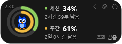

# 설치

Windows 10 1809 이상. **관리자 권한이 필요 없다** — 사용자 폴더에 깔린다.

## 1. 받는다

[릴리스](https://github.com/ldg030201/dong-csu/releases)에서 제목이 `Windows` 로
시작하는 것을 찾아 **`DongCSU-win-Setup.exe`** 를 받는다.

> 제목이 `macOS` 인 릴리스는 맥 것이다. 두 판이 한 저장소에 있어서 번갈아 올라온다.

## 2. 깐다

받은 파일을 두 번 누른다. 물어보는 것도, 고를 것도 없다 — 다 깔리면 알아서 뜬다.

**"Windows의 PC 보호" 창이 뜨면** `추가 정보` → `실행`을 누른다. 서명 인증서를 사지
않아서 그렇다. 무엇이 깔리는지는 [소스](https://github.com/ldg030201/dong-csu/tree/main/win)에
다 있다.

깔리는 곳은 `%LOCALAPPDATA%\DongCSU` 다.

## 3. 로그인

**따로 로그인하지 않는다.** Claude Code 가 저장해 둔 것을 읽는다.

Claude Code 로 아무 대화나 한 번 해 본 적이 있으면 그것으로 끝이다. 사용량이 안 나오면
설정 창 **계정** 탭을 연다 — 어디를 찾아봤고 왜 못 읽었는지 그대로 적혀 있다.

## 처음 뜨면

작업 표시줄에는 안 나온다. **트레이(시계 옆)에 부엉이가 생긴다.**

| | |
| --- | --- |
| 트레이 아이콘 왼쪽 클릭 | HUD 를 숨겼다 보였다 |
| 트레이 아이콘 오른쪽 클릭 | 새로고침 · 설정 · 종료 |
| HUD 를 끌기 | 옮긴다. 자리는 기억한다 |
| HUD 를 두 번 누르기 | 마스코트만 남는 **펫 모드** |

## 업데이트

**앱이 알아서 한다.** 하루에 한 번 새 버전을 보고, 있으면 설정 창 **버전** 탭에 표시가
붙는다. 거기서 누르면 받고, 다 받으면 물어본 뒤에 껐다 다시 뜬다.

끄고 싶으면 버전 탭의 `하루에 한 번 새 버전 확인` 을 끈다.

## 지우기

설정 → 앱 → 설치된 앱 에서 `DongCSU` 를 지운다.

설정과 기록은 `%APPDATA%\DongCSU\` 에 남는다. 그것까지 지우려면 그 폴더를 지운다.
**갱신해 둔 토큰(`token.json`)도 거기 있다.**
